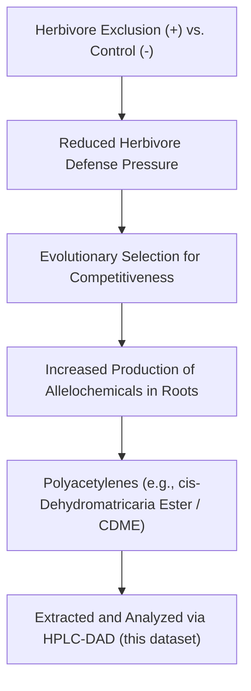

# Solidago altissima Root Extracts (HPLC-DAD) Dataset Primer

This primer outlines the ecological context, chemical significance, and detailed data structure of the *Solidago altissima* root extracts dataset downloaded from the CRAN/GitHub package `chromatographR` (authored by Ethan Bass). 

---

## 1. Ecological and Chemical Context

### The Botanical System
* **Species:** *Solidago altissima* (Tall Goldenrod), a perennial wildflower native to North America.
* **Biological Context:** The dataset is derived from root chemistry research conducted by **Akane Uesugi and André Kessler (2013)**: *"Herbivore exclusion drives the evolution of plant competitiveness via increased allelopathy"* (published in *New Phytologist*).
* **The Study Hypothesis:** Under long-term herbivore exclusion (where insect pests are controlled using insecticide), goldenrod plants are freed from investing energy into anti-herbivore defenses. Consequently, natural selection favors genotypes that invest more in competition, primarily through **allelopathy**—the release of toxic secondary metabolites from their roots to suppress neighboring plant competitors.



### Chemical Profiling
* **Target Compounds:** The primary root allelochemicals of interest in *Solidago altissima* are **polyacetylenes**, particularly **cis-dehydromatricaria ester (CDME)**. Polyacetylenes are highly active phytotoxic organic compounds that exhibit strong absorption in the UV range.
* **Analytical Instrument:** High-Performance Liquid Chromatography coupled with a Diode-Array Detector (**HPLC-DAD**).
* **Monitored Wavelengths:** 
  * **210 nm:** A general wavelength used to monitor organic compounds (many simple organic acids, lipids, and terpenoids exhibit peak absorbance here).
  * **260 nm:** Used to selectively monitor conjugated systems (conjugated double and triple bonds characteristic of polyacetylenes like CDME).

---

## 2. Directory and File Structure

The downloaded data files are located in:
`[data/chroma/solidago/](file:///Users/damm/Projects/pinn_parafac/data/chroma/solidago/)`

There are five core files:
1. **`[Sa.RData](file:///Users/damm/Projects/pinn_parafac/data/chroma/solidago/Sa.RData)`**: The raw, unaligned, and un-interpolated chromatography matrices.
2. **`[Sa_pr.RData](file:///Users/damm/Projects/pinn_parafac/data/chroma/solidago/Sa_pr.RData)`**: Preprocessed chromatography matrices (smoothed, baseline-corrected, and interpolated to a uniform retention time grid).
3. **`[Sa_warp.RData](file:///Users/damm/Projects/pinn_parafac/data/chroma/solidago/Sa_warp.RData)`**: Retention-time aligned (warped) chromatography matrices generated by `chromatographR` alignment routines.
4. **`[pk_tab.RData](file:///Users/damm/Projects/pinn_parafac/data/chroma/solidago/pk_tab.RData)`**: Peak-picking table containing peak areas and individual peak metadata.
5. **`[Sa_metadata.csv](file:///Users/damm/Projects/pinn_parafac/data/chroma/solidago/Sa_metadata.csv)`**: Simple CSV metadata file describing the experimental variables.

---

## 3. Detailed Data Structures

### Sample Metadata (`Sa_metadata.csv`)
A small experimental cohort of **4 samples** is tracked in the CSV:

| vial | mass (mg) | trt | Description |
|---|---|---|---|
| **119** | 100 | `+` | Root extract, treated (herbivore exclusion / insecticide) |
| **122** | 120 | `+` | Root extract, treated (herbivore exclusion / insecticide) |
| **121** | 92 | `-` | Root extract, control (exposed to insect herbivory) |
| **458** | 115 | `-` | Root extract, control (exposed to insect herbivory) |

---

### Chromatographic Tensors (`Sa.RData`, `Sa_pr.RData`, `Sa_warp.RData`)
Each RData file converts into a Python dictionary where keys match the sample IDs: `['119', '121', '122', '458']`. The values are `xarray.DataArray` structures:

| Dataset File | Dimensions | Time Coordinate Range | Wavelength Coordinate Range | Notes |
|---|---|---|---|---|
| **`Sa.RData`** | `(1301, 60)` | `9.999` to `18.666` min | `200.0` to `318.0` nm (step: 2 nm) | Raw HPLC-DAD matrices. RT scanning intervals can be slightly uneven. |
| **`Sa_pr.RData`** | `(434, 60)` | `10.00` to `18.66` min (step: 0.02 min) | `200` to `318` nm (step: 2 nm) | Preprocessed. Uniform time grid, baseline-subtracted. |
| **`Sa_warp.RData`** | `(434, 60)` | `10.00` to `18.66` min (step: 0.02 min) | `200` to `318` nm (step: 2 nm) | Aligned/warped by R package routines. |

> [!NOTE]
> The downsampling from **1301** to **434** time steps in the preprocessed files is due to resampling/interpolation onto a uniform time grid (`10.00, 10.02, ..., 18.66` min). Stacking these 2D grids results in a 3D tensor of shape **`(4, 434, 60)`** representing `(Samples, Time, Wavelengths)`.

---

## 4. Peak Table and Fit Metrics (`pk_tab.RData`)
This file contains a nested structure of resolved peaks after peak-fitting (Exponentially Modified Gaussian - EMG models):

#### 1. Peak Intensity Matrix (`pk_tab['tab']`)
A Pandas DataFrame of shape `(4, 65)` containing peak areas/intensities for **65 resolved chemical peaks** (labeled `V1` to `V65`) across the 4 samples.

#### 2. Peak Metadata (`pk_tab['pk_meta']`)
A Pandas DataFrame of shape `(10, 65)` detailing the characteristics of each resolved peak:

| Parameter | Type / Range | Description |
|---|---|---|
| **`lambda`** | `210.0` or `260.0` nm | **33 peaks** were detected at `210 nm`, and **32 peaks** at `260 nm` (total = 65). |
| **`peak`** | `1.0` to `33.0` | Peak number within each wavelength group. |
| **`rt`** | `10.02` to `18.50` min | Retention time of the peak apex. |
| **`start`** / **`end`** | minutes | Peak integration boundaries. |
| **`sd`** | `0.04` to `0.10` | Standard deviation of the Gaussian component. |
| **`tau`** | `-0.16` to `0.08` | Exponential decay constant (peak tailing). |
| **`FWHM`** | `0.040` to `0.650` min | Full Width at Half Maximum (mean = `0.168` min). |
| **`r.squared`** | `0.550` to `1.000` | Goodness-of-fit for the EMG peak shape fit (mean = `0.924`). |

---

## 5. HPLC-DAD Non-Trilinear Challenges

In classical chemometrics, multi-way analysis (like PARAFAC) requires strict trilinearity. However, this dataset demonstrates typical HPLC-DAD non-trilinear behavior:
1. **Retention Time Shifting & Stretching:** Variations in room temperature, column pressure, and mobile phase flow rate across the runs cause peaks to shift and stretch slightly. For example, peak maximums might elute at `10.02` min in one sample and `10.08` min in another.
2. **Baseline Drift:** Solvent gradients (methanol/water elution) cause the baseline absorbance to drift upwards over time, which interferes with absolute compound quantification.

### Chroma-PETN Solution
Our Physics-Embedded Tensor Network (**Chroma-PETN**) addresses these issues directly inside the model graph:
* **Differentiable Warping Head:** Rather than manual alignment, it learns continuous sample-specific stretch ($\alpha_i$) and shift ($\beta_i$) parameters to dynamically warp time coordinates:
  $$t'_{i, j} = t_j - (\alpha_i \cdot t_j + \beta_i)$$
* **Analytical Savitzky-Golay Derivatives:** Resolves the baseline drift by training on analytical second-derivatives ($d=2$) computed via custom convolution kernels during the forward pass.
* **Mean-Centering Constraints:** Anchors the canonical peak profile embedding $B$ by enforcing $\sum \alpha_i = 0$ and $\sum \beta_i = 0$ at each step.

---

## 6. Python Integration: Loading Recipe

Below is a complete Python utility recipe to load `Sa_pr.RData` and metadata, stacking them into a 3D NumPy tensor suitable for **Chroma-PETN** training:

```python
import os
import rdata
import pandas as pd
import numpy as np

def load_solidago_dataset(data_dir):
    """
    Loads preprocessed Solidago altissima HPLC-DAD chromatograms and aligns them into a 3D tensor.
    
    Args:
        data_dir: Path to directory containing Sa_pr.RData and Sa_metadata.csv
        
    Returns:
        X: 3D NumPy array of shape (Samples=4, Time=434, Wavelengths=60)
        metadata: Pandas DataFrame of shape (4, 3)
        time_coords: NumPy array of time steps (length 434)
        wavelength_coords: NumPy array of wavelengths (length 60)
    """
    # 1. Load Metadata
    metadata_path = os.path.join(data_dir, "Sa_metadata.csv")
    metadata = pd.read_csv(metadata_path)
    metadata['vial'] = metadata['vial'].astype(str) # ensure string keys
    
    # 2. Parse RData
    rdata_path = os.path.join(data_dir, "Sa_pr.RData")
    parsed = rdata.parser.parse_file(rdata_path)
    converted = rdata.conversion.convert(parsed)
    sa_pr = converted['Sa_pr']
    
    # Samples are stored as keys matching the vial numbers
    sample_keys = [str(v) for v in metadata['vial']]
    
    # 3. Read Coordinates from the first sample
    first_sample = sa_pr[sample_keys[0]]
    # Coordinates inside the xarray are stored as strings; convert to float
    time_coords = first_sample.coords['dim_0'].values.astype(float)
    wavelength_coords = first_sample.coords['dim_1'].values.astype(float)
    
    # 4. Construct the 3D Tensor
    I, J, K = len(sample_keys), len(time_coords), len(wavelength_coords)
    X = np.zeros((I, J, K))
    
    for idx, sample_id in enumerate(sample_keys):
        # Extract the underlying numpy array from xarray.DataArray
        X[idx] = sa_pr[sample_id].values
        
    print(f"Loaded Solidago Dataset:")
    print(f"  Tensor shape: {X.shape} (Samples x Time x Spectra)")
    print(f"  Time range: [{time_coords.min():.2f}, {time_coords.max():.2f}] minutes")
    print(f"  Wavelengths: {wavelength_coords.tolist()[:3]} ... {wavelength_coords.tolist()[-3:]} nm")
    
    return X, metadata, time_coords, wavelength_coords

# Example Usage:
# X, meta, times, lambdas = load_solidago_dataset("data/chroma/solidago")
```
