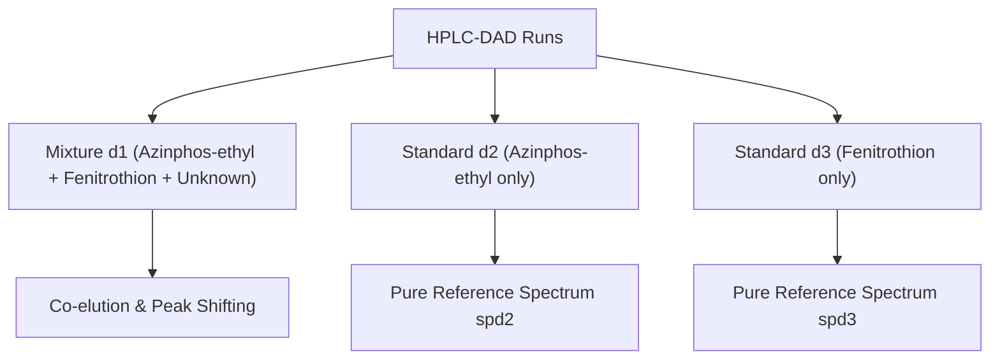

# Tauler Pesticides HPLC-DAD Real Dataset (A) Primer

This primer outlines the chemical significance, experimental context, and detailed data structures of the Real HPLC-DAD Pesticides Dataset A hosted on the CSIC MCR-ALS homepage (originally published by R. Tauler, S. Lacorte, and D. Barceló in 1996).

---

## 1. Chemical and Experimental Context

### Organophosphorus Pesticides in Natural Waters
* **Target Analytes:** 
  1. **Azinphos-ethyl:** An organophosphorus insecticide used to control insect pests on crops. Highly toxic acetylcholinesterase inhibitor.
  2. **Fenitrothion:** Another widely used organophosphorus insecticide, structurally related.
  3. **Unknown Interferent:** A third chemical compound co-eluting in natural water samples that interferes with standard chromatographic signals.
* **Analytical Instrument:** High-Performance Liquid Chromatography coupled with Diode Array Detection (**HPLC-DAD**).
* **The Calibration Challenge:** Natural water runs contain co-eluting peaks and unknown chemical background interferences. Traditional calibration assumes pure signals, but the co-elution of target analytes and the unknown interferent violates structural assumptions.



---

## 2. Directory and File Structure

The downloaded files are located in:
`[data/chroma/tauler_a/](file:///home/damianp/Proyectos/pinn_parafac/data/chroma/tauler_a)`

* **`[adataset.mat](file:///home/damianp/Proyectos/pinn_parafac/data/chroma/tauler_a/adataset.mat)`**: The MATLAB v5 workspace file containing the matrices.
* **`[adataset.htm](file:///home/damianp/Proyectos/pinn_parafac/data/chroma/tauler_a/adataset.htm)`**: The HTML metadata description.

---

## 3. Detailed Data Structures

The `.mat` file contains the following arrays:

| Variable | Dimension | Physical Representation | Description |
|---|---|---|---|
| **`d1`** | `(99, 73)` | Chromatographic mixture run | Mixture containing Azinphos-ethyl, Fenitrothion, and Unknown. |
| **`d2`** | `(99, 73)` | Chromatographic standard run 1 | Standard solution containing only Azinphos-ethyl. |
| **`d3`** | `(99, 73)` | Chromatographic standard run 2 | Standard solution containing only Fenitrothion. |
| **`spd2`** | `(1, 73)` | Pure spectral profile of Analyte 1 | Reference spectrum for Azinphos-ethyl. |
| **`spd3`** | `(1, 73)` | Pure spectral profile of Analyte 2 | Reference spectrum for Fenitrothion. |

> [!NOTE]
> Stacking these three runs along the first dimension results in a single 3D dense tensor of shape **`(3, 99, 73)`** representing `(Samples, Time, Wavelengths)`.

---

## 4. Selectivity Constraints in Calibration

To achieve a physically meaningful decomposition and resolve the rotational ambiguity, we enforce **selectivity (local rank) constraints** on the concentration score matrix ($A$):

1. **Component 1 (Azinphos-ethyl):** Must be exactly zero in Standard 2 (`d3`):
   $$A[2, 0] = 0$$
2. **Component 2 (Fenitrothion):** Must be exactly zero in Standard 1 (`d2`):
   $$A[1, 1] = 0$$
3. **Component 3 (Unknown Interferent):** Must be exactly zero in both Standard 1 (`d2`) and Standard 2 (`d3`):
   $$A[1, 2] = 0 \quad \text{and} \quad A[2, 2] = 0$$

These constraints force the network to allocate the chemical signals to their respective compartments during optimization.

---

## 5. HPLC-DAD Non-Trilinear Challenges

The dataset highlights non-trilinear interferences in liquid chromatography:
1. **Peak Shifting:** The retention time profiles shift slightly across different injections. In standard 1, Azinphos-ethyl peaks at scan 35, whereas in standard 2, Fenitrothion peaks at scan 37. In the mixture run, co-elution shifts the peaks to scans 28 and 57 due to local flow rate/pressure differences.
2. **Chroma-PETN Warping Head:** The model learns continuous sample-specific stretch ($\alpha_i$) and shift ($\beta_i$) parameters to dynamically warp coordinates and align the chromatograms.
   $$t'_{i, j} = t_j - (\alpha_i \cdot t_j + \beta_i)$$

---

## 6. Python Integration: Loading Recipe

Below is the Python utility code to load the `adataset.mat` file and compile the runs into a 3D tensor:

```python
import os
import scipy.io
import numpy as np

def load_tauler_a_dataset(data_dir):
    """
    Loads Tauler's HPLC-DAD Real Dataset A from adataset.mat.
    Stacks mixture and standards into a 3D tensor.
    
    Returns:
        X: 3D NumPy array of shape (Samples=3, Time=99, Wavelengths=73)
        spd2: 1D reference spectrum array of shape (73,)
        spd3: 1D reference spectrum array of shape (73,)
        time_coords: NumPy array of time indices (length 99)
        wavelength_coords: NumPy array of wavelength coordinates (length 73)
    """
    mat_path = os.path.join(data_dir, "adataset.mat")
    mat = scipy.io.loadmat(mat_path)
    
    d1 = mat['d1']  # (99, 73)
    d2 = mat['d2']  # (99, 73)
    d3 = mat['d3']  # (99, 73)
    
    spd2 = mat['spd2'].squeeze()  # (73,)
    spd3 = mat['spd3'].squeeze()  # (73,)
    
    # Stack into a 3D tensor (Samples, Time, Wavelengths)
    X = np.stack([d1, d2, d3], axis=0)
    
    time_coords = np.arange(99, dtype=float)
    wavelength_coords = np.linspace(200.0, 300.0, 73) 
    
    print(f"Loaded Tauler Dataset A:")
    print(f"  Tensor shape: {X.shape} (Samples x Time x Spectra)")
    print(f"  Reference spectrum 1 (Azinphos-ethyl) shape: {spd2.shape}")
    print(f"  Reference spectrum 2 (Fenitrothion) shape: {spd3.shape}")
    
    return X, spd2, spd3, time_coords, wavelength_coords
```
