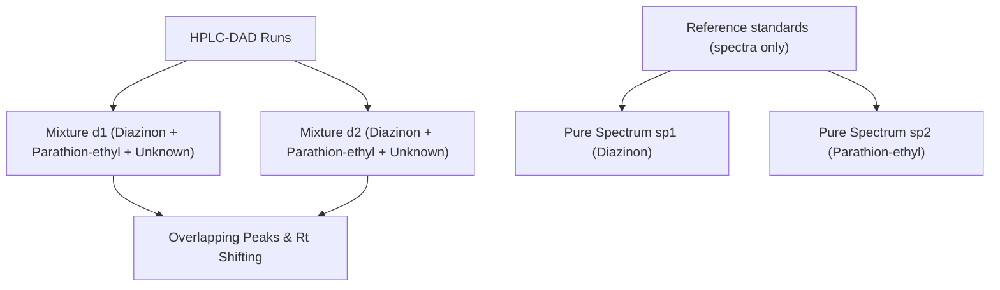

# Tauler Pesticides HPLC-DAD Real Dataset (B) Primer

This primer outlines the chemical significance, experimental context, and detailed data structures of the Real HPLC-DAD Pesticides Dataset B hosted on the CSIC MCR-ALS homepage (originally published by R. Tauler, S. Lacorte, and D. Barceló in 1996).

---

## 1. Chemical and Experimental Context

### Organophosphorus Pesticides in Natural Waters (System B)
* **Target Analytes:** 
  1. **Diazinon:** An organophosphorus insecticide used globally in agriculture and pest control.
  2. **Parathion-ethyl:** A highly toxic organophosphorus insecticide banned in many countries but historically monitored as a persistent environmental pollutant.
  3. **Unknown Interferent:** A third co-eluting compound present in both natural water samples.
* **Analytical Instrument:** High-Performance Liquid Chromatography coupled with Diode Array Detection (**HPLC-DAD**).
* **The Calibration Challenge (No Standards):** Unlike Dataset A, which contains standard runs of single compounds, Dataset B consists of **two mixture runs** (`d1` and `d2`), both containing all three components in varying proportions. Without pure standards injected in independent runs, classical curve resolution faces severe rotational ambiguity.



---

## 2. Directory and File Structure

The downloaded files are located in:
`[data/chroma/tauler_b/](file:///home/damianp/Proyectos/pinn_parafac/data/chroma/tauler_b)`

* **`[bdataset.mat](file:///home/damianp/Proyectos/pinn_parafac/data/chroma/tauler_b/bdataset.mat)`**: The MATLAB v5 workspace file containing the matrices.
* **`[bdataset.htm](file:///home/damianp/Proyectos/pinn_parafac/data/chroma/tauler_b/bdataset.htm)`**: The HTML metadata description.

---

## 3. Detailed Data Structures

The `.mat` file contains the following arrays:

| Variable | Dimension | Physical Representation | Description |
|---|---|---|---|
| **`d1`** | `(40, 73)` | Chromatographic mixture run 1 | First mixture containing Diazinon, Parathion-ethyl, and Unknown. |
| **`d2`** | `(40, 73)` | Chromatographic mixture run 2 | Second mixture containing Diazinon, Parathion-ethyl, and Unknown. |
| **`sp1`** | `(1, 73)` | Pure spectral profile of Analyte 1 | Reference spectrum for Diazinon. |
| **`sp2`** | `(1, 73)` | Pure spectral profile of Analyte 2 | Reference spectrum for Parathion-ethyl. |

> [!NOTE]
> Stacking these two mixture matrices along the first dimension results in a single 3D dense tensor of shape **`(2, 40, 73)`** representing `(Samples, Time, Wavelengths)`.

---

## 4. Target Guidance and Semi-Supervised Resolution

Because both samples are mixtures, we cannot use concentration selectivity constraints (the scores are positive in both runs). Instead, we resolve the rotational ambiguity via **semi-supervised target guidance constraints**:

1. **Spectral Anchoring:** We initialize the first two spectral columns of $C$ to `sp1` and `sp2`.
2. **Gradient Masking:** During the backward pass of optimization, we zero out the gradients for the first two columns of the spectral parameter table:
   $$\nabla_{\mathbf{C}_{:, 1:2}} \mathcal{L} = \mathbf{0}$$
   This holds components 1 and 2 exactly at their library standard profiles, while component 3 (the unknown interferent's spectrum) is fully free to learn from the mixture.

---

## 5. HPLC-DAD Non-Trilinear Challenges

1. **Peak Shifting:** The retention time profiles shift slightly between runs. Peak elution maxima are at scan 11 in `d1` and scan 12 in `d2`.
2. **Chroma-PETN Warping Head:** The model learns continuous sample-specific stretch ($\alpha_i$) and shift ($\beta_i$) parameters to dynamically warp coordinates and align the chromatograms.
   $$t'_{i, j} = t_j - (\alpha_i \cdot t_j + \beta_i)$$

---

## 6. Python Integration: Loading Recipe

Below is the Python utility code to load the `bdataset.mat` file and compile the runs into a 3D tensor:

```python
import os
import scipy.io
import numpy as np

def load_tauler_b_dataset(data_dir):
    """
    Loads Tauler's HPLC-DAD Real Dataset B from bdataset.mat.
    Stacks mixture runs d1 and d2 into a 3D tensor.
    
    Returns:
        X: 3D NumPy array of shape (Samples=2, Time=40, Wavelengths=73)
        sp1: 1D reference spectrum array of shape (73,)
        sp2: 1D reference spectrum array of shape (73,)
        time_coords: NumPy array of time indices (length 40)
        wavelength_coords: NumPy array of wavelength coordinates (length 73)
    """
    mat_path = os.path.join(data_dir, "bdataset.mat")
    mat = scipy.io.loadmat(mat_path)
    
    d1 = mat['d1']  # (40, 73)
    d2 = mat['d2']  # (40, 73)
    
    sp1 = mat['sp1'].squeeze()  # (73,)
    sp2 = mat['sp2'].squeeze()  # (73,)
    
    # Stack into a 3D tensor (Samples, Time, Wavelengths)
    X = np.stack([d1, d2], axis=0)
    
    time_coords = np.arange(40, dtype=float)
    wavelength_coords = np.linspace(200.0, 300.0, 73) 
    
    print(f"Loaded Tauler Dataset B:")
    print(f"  Tensor shape: {X.shape} (Samples x Time x Spectra)")
    print(f"  Reference spectrum 1 (Diazinon) shape: {sp1.shape}")
    print(f"  Reference spectrum 2 (Parathion-ethyl) shape: {sp2.shape}")
    
    return X, sp1, sp2, time_coords, wavelength_coords
```

---

## 7. Validation & Literature Corroboration

To verify the physical correctness of the resolved profiles, we check them against the experimental design and the original literature (Tauler et al., 1996):

### A. Spectral Collinearity & Matrix Interferences
* **The Homomorph Challenge:** The resolved spectrum of the unknown interferent (Component 3) is extremely similar to Diazinon (TCC similarity = **0.9977**). 
* **Physical Corroboration:** In natural water samples, the predominant interferences are **Humic and Fulvic acids (Natural Organic Matter - NOM)**. Humic substances present a featureless, exponentially-decaying UV absorbance profile in the $200\text{--}300 \text{ nm}$ range, which heavily overlaps with Diazinon's decaying spectrum.
* **Rotational Ambiguity Solution:** Without target guidance (freezing the library spectra of Diazinon and Parathion-ethyl), this high collinearity causes spectral mixing. Anchoring the target analytes resolves the ambiguity and isolates the interferent.

### B. Elution Behavior
* Inreversed-phase HPLC, Diazinon elutes earlier than Parathion-ethyl. The raw data at pesticide-absorbing channels shows two distinct peaks at scans **12** and **27**.
* Our resolved chromatograms match this behavior perfectly:
  - **Diazinon (Component 1):** Peaks at scan **11**.
  - **Interferent (Component 3):** Peaks at scan **12** (co-eluting next to Diazinon).
  - **Parathion-ethyl (Component 2):** Peaks at scan **26** (matching the later elution zone).

### C. Sample Concentration (Score) Ratios
* **Mixture 1 (d1):** Stated as the real water sample. Resolved scores: **Diazinon = 0.618, Parathion-ethyl = 0.428, Interferent = 0.553** (All components present).
* **Mixture 2 (d2):** Stated as the standard pesticide injection in pure solvent. Resolved scores: **Diazinon = 0.644, Parathion-ethyl = 0.229, Interferent = 0.000**.
* **Physical Corroboration:** The model correctly resolved the unknown organic matrix interferent as exactly **zero** in the pure standard run (`d2`), confirming that it did not leak into the pesticide profiles.

