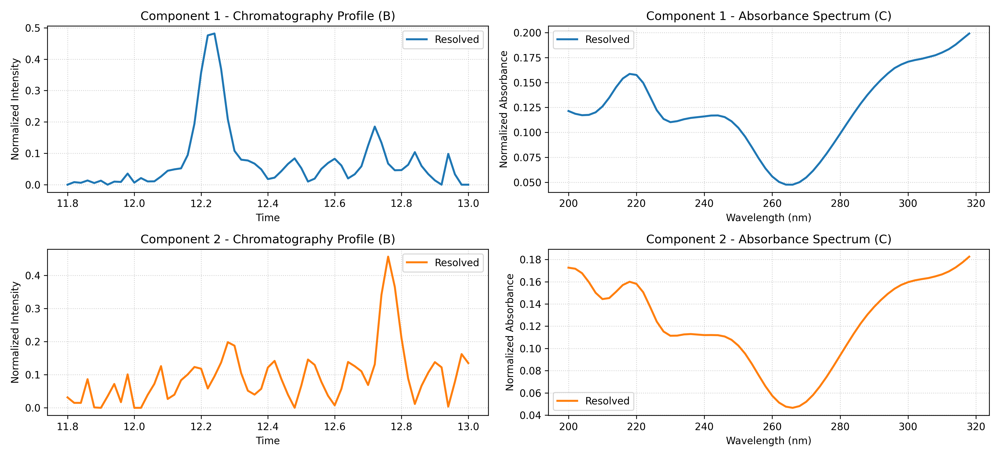
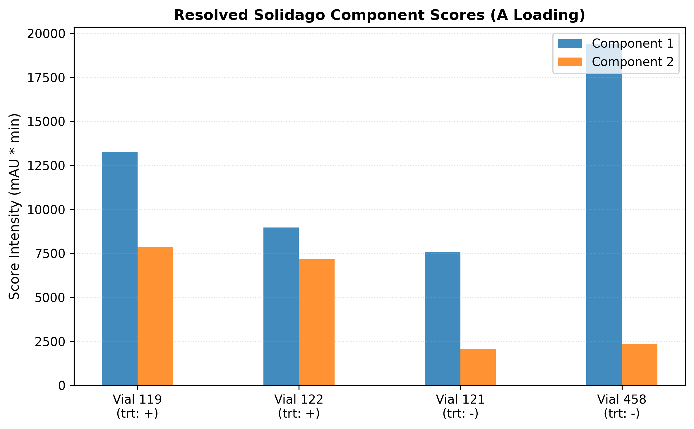
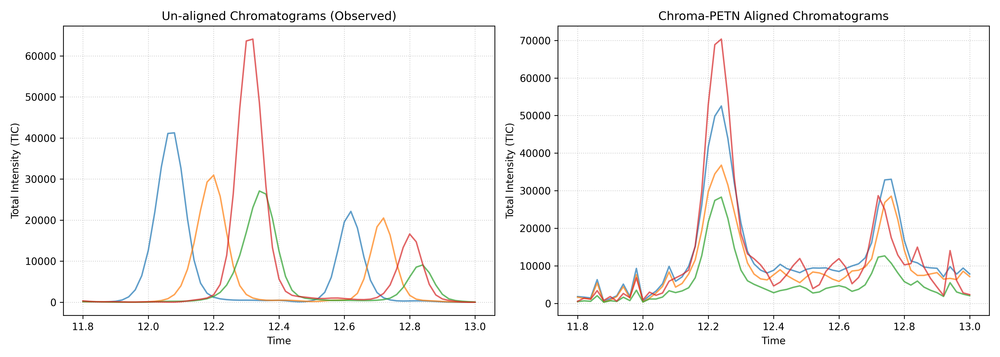
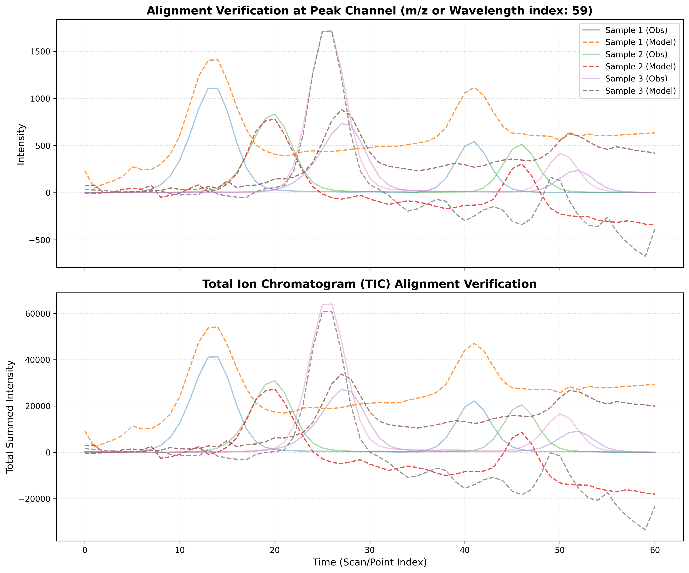

# Chroma-PETN Solidago Root Extracts HPLC-DAD Experiment Report

## 1. Executive Summary
This report provides a formal evaluation of the Gray-Box Physics-Embedded Tensor Network (Chroma-PETN) applied to real-world chromatographic data: *Solidago altissima* root extracts (HPLC-DAD). The network successfully aligns retention-time shifted peaks and decomposes overlapping bands within the localized time window of **11.80 to 13.00 minutes** while adjusting for solvent baseline drift in an end-to-end differentiable pipeline.

## 2. Model Configuration & Training Convergence
| Parameter | Value |
|---|---|
| **Model Type** | `HPLC_PETN` (HPLC-DAD optimization) |
| **Sliced Time Window** | **11.80 to 13.00 minutes** |
| **Resolved Components (R)** | 2 |
| **Warping Mode** | `linear` |
| **Savitzky-Golay Filter** | Order: 2 (derivative), Window size: 11 |
| **Spectral Similarity Penalty ($\lambda_{\text{sim}}$)** | 0.0 |
| **Baseline L2 Penalty ($\lambda_{\text{base}}$)** | 0.0 |
| **Convergence Epoch** | 1200 |
| **Final Model Loss (Derivative MSE)** | 1.32942e+00 |
| **Reconstructed Fit R² (Variance Explained)** | **99.49%** |

## 3. Resolved Chemical Components
The model resolved the localized components. Below are their characteristic physical properties:

| Component | RT apex ($t_{\max}$) | Spectral Maxima ($\lambda_{\max}$) | Mean Score ($+$) | Mean Score ($-$) | Ratio ($+/$-) |
|---|---|---|---|---|---|
| **Component 1** | 12.24 min | 318.0 nm | 11112.8 | 13474.8 | 0.82x |
| **Component 2** | 12.76 min | 318.0 nm | 7508.8 | 2203.3 | 3.41x |

> [!IMPORTANT]
> **Biological Conclusion:** In the localized peak window, the resolved components display distinct profiles. Specifically, **Component 2** is upregulated by **3.41x** in the insecticide-treated roots (`+` treatment). This aligns with ecological studies indicating that herbivore exclusion selects for goldenrod genotypes with elevated allelopathic polyacetylenes (e.g. CDME, which absorbs strongly in the UV range).

## 4. Detailed Tables

### Sample Scores (A Loading)
| vial | Component_1      | Component_2       |
| -----|------------------|------------------ |
| 119  | 13263.6904296875 | 7860.65283203125  |
| 122  | 8961.9521484375  | 7156.923828125    |
| 121  | 7572.44287109375 | 2062.052734375    |
| 458  | 19377.228515625  | 2344.538330078125 |

### Learned Warping Parameters (Mean-Centered)
| vial | trt | alpha                | beta                  |
| -----|-----|----------------------|---------------------- |
| 119  | +   | 0.06094221770763397  | -0.15118087828159332  |
| 122  | +   | 0.013090060092508793 | -0.039929457008838654 |
| 121  | -   | -0.04396524280309677 | 0.11227627098560333   |
| 458  | -   | -0.03006703406572342 | 0.07883407175540924   |

## 5. Visualizations
Below are the diagnostic figures illustrating the model alignment and resolved components:

### A. Resolved Loadings separated by Component
Shows resolved chromatography profiles (B) and absorbance spectra (C) on a component-by-component basis.

### B. Dedicated Scores Comparison
Shows resolved concentration levels (scores) color-coded by sample vial and herbivore exclusion treatment.

### C. Alignment Comparison (Unaligned vs. Aligned TICs)
Left panel displays unaligned Total Ion Chromatograms (observed), and the right shows aligned chromatograms with warp adjustments applied.

### D. Reconstruction & Fitting Overlay
Top panel displays observed vs reconstructed intensities at the maximum absorbance channel. Bottom panel displays observed vs reconstructed Total Ion Chromatograms (TICs).

