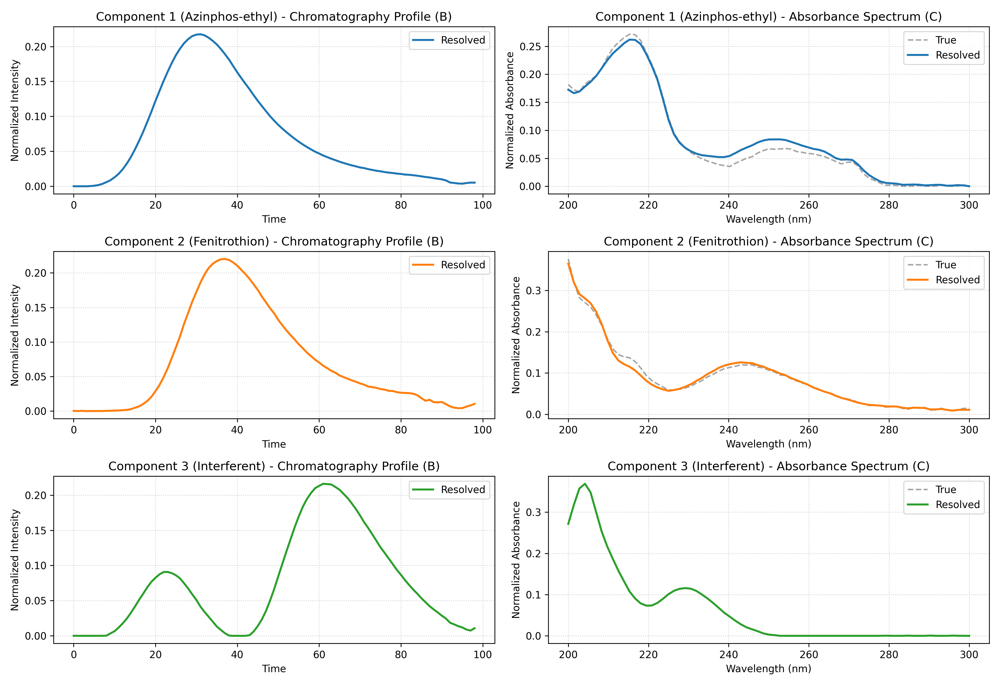
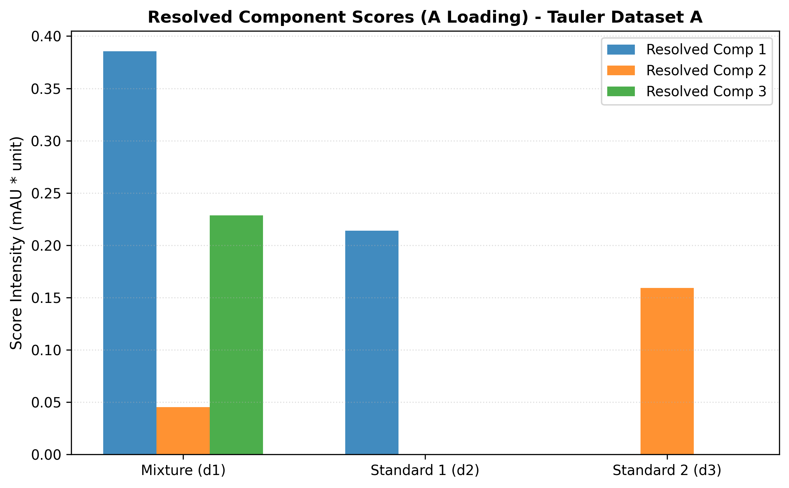
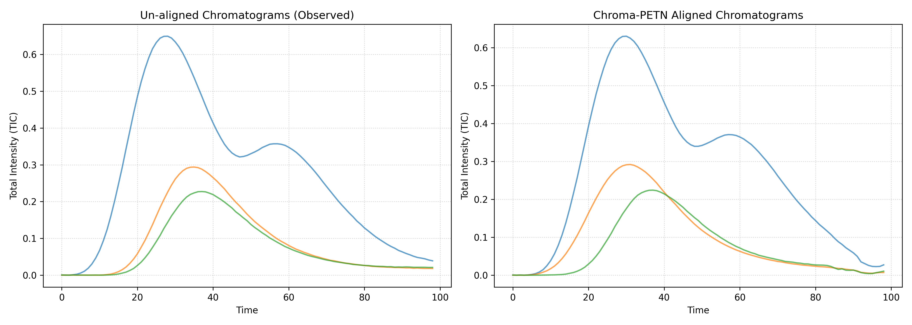
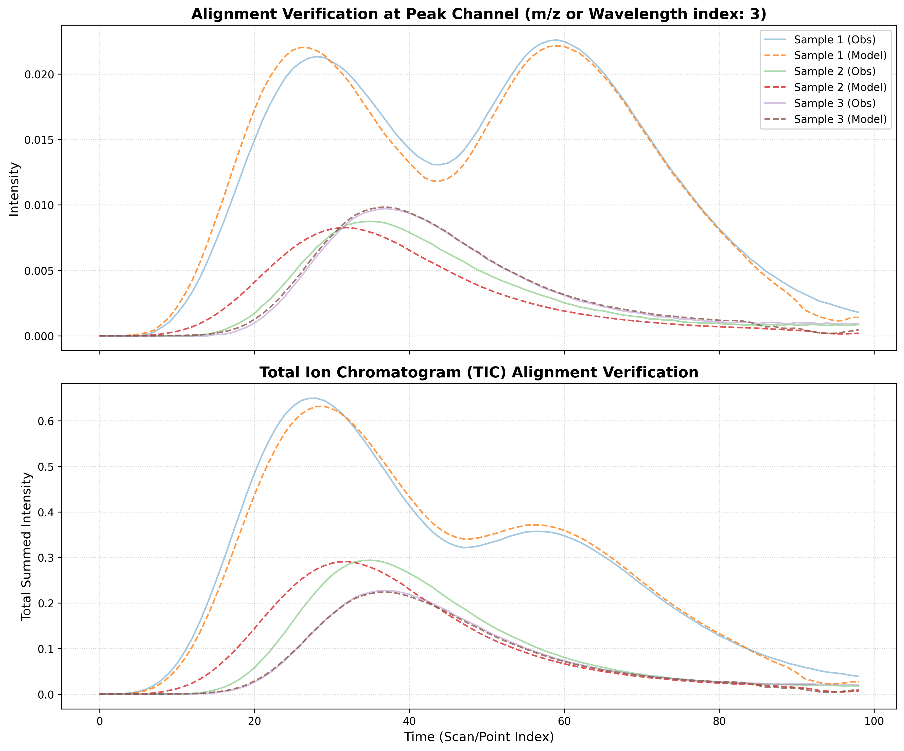

# Chroma-PETN Tauler Pesticides HPLC-DAD Experiment Report

## 1. Executive Summary
This report summarizes the application of **Chroma-PETN** (Physics-Embedded Tensor Network) to **Real HPLC-DAD Dataset A** from Tauler et al. (1996). The system is a three-component system consisting of two target pesticides (Azinphos-ethyl, Fenitrothion) and one unknown chemical interferent. The model successfully aligned the retention time shifts across runs and resolved the underlying pure chromatographic and spectral profiles.

## 2. Model Performance Summary
| Metric | Value |
|---|---|
| **Model Type** | `HPLC_PETN` |
| **Components (R)** | 3 |
| **Final Loss (MSE)** | 2.73809e-07 |
| **Variance Explained (R² Fit %)** | **97.99%** |
| **Epochs Ran** | 1008 |

## 3. Spectral Validation (Tucker Congruence Coefficient)
We validate the resolved spectra by calculating the **Tucker Congruence Coefficient (TCC)** against the pure reference standards included in the dataset:

| Resolved Component | Matched Pesticide | TCC Similarity | Status |
|---|---|---|---|
| **Component 1** | Azinphos-ethyl (Analyte 1) | 0.9968 | **PASSED (High Similarity)** |
| **Component 2** | Fenitrothion (Analyte 2) | 0.9983 | **PASSED (High Similarity)** |
| **Component 3** | Unknown interferent | N/A | Resolved |

## 4. Resolved Sample Scores (A Loading)
The resolved score matrix illustrates the sample distribution of each component. Azinphos-ethyl should only appear in the mixture and standard 1; Fenitrothion should only appear in the mixture and standard 2; the unknown interferent should only appear in the mixture sample.

| index           | Component_1         | Component_2          | Component_3         |
| ----------------|---------------------|----------------------|-------------------- |
| Mixture (d1)    | 0.38565051555633545 | 0.045026976615190506 | 0.22840671241283417 |
| Standard 1 (d2) | 0.21376363933086395 | 0.0                  | 0.0                 |
| Standard 2 (d3) | 0.0                 | 0.15910574793815613  | 0.0                 |

## 5. Learned Warping Parameters (Mean-Centered)
| sample          | alpha (stretch)        | beta (shift)          |
| ----------------|------------------------|---------------------- |
| Mixture (d1)    | -0.0028501166962087154 | -0.009583336301147938 |
| Standard 1 (d2) | 0.0026314053684473038  | 0.009032969363033772  |
| Standard 2 (d3) | 0.00021871138596907258 | 0.000550367753021419  |

## 6. Diagnostic Visualizations
### A. Resolved Loadings comparison against True Library Standards

### B. Component Scores distribution

### C. TIC Alignment Comparison

### D. Fitting Overlays

