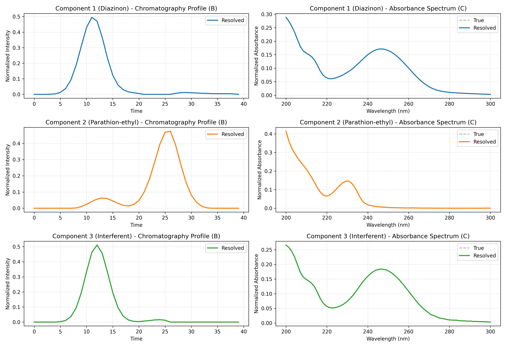
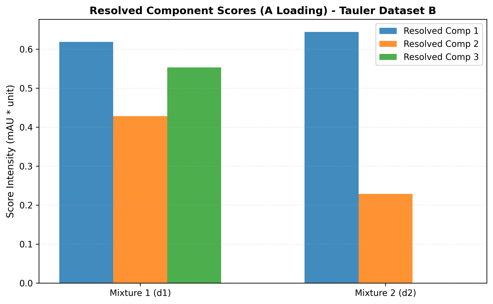
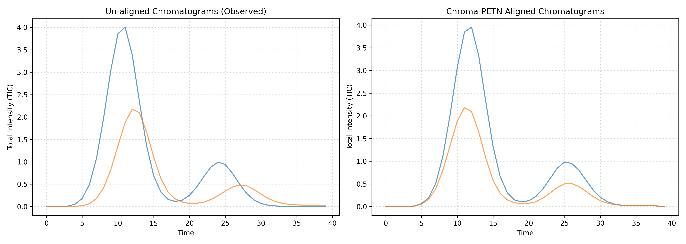
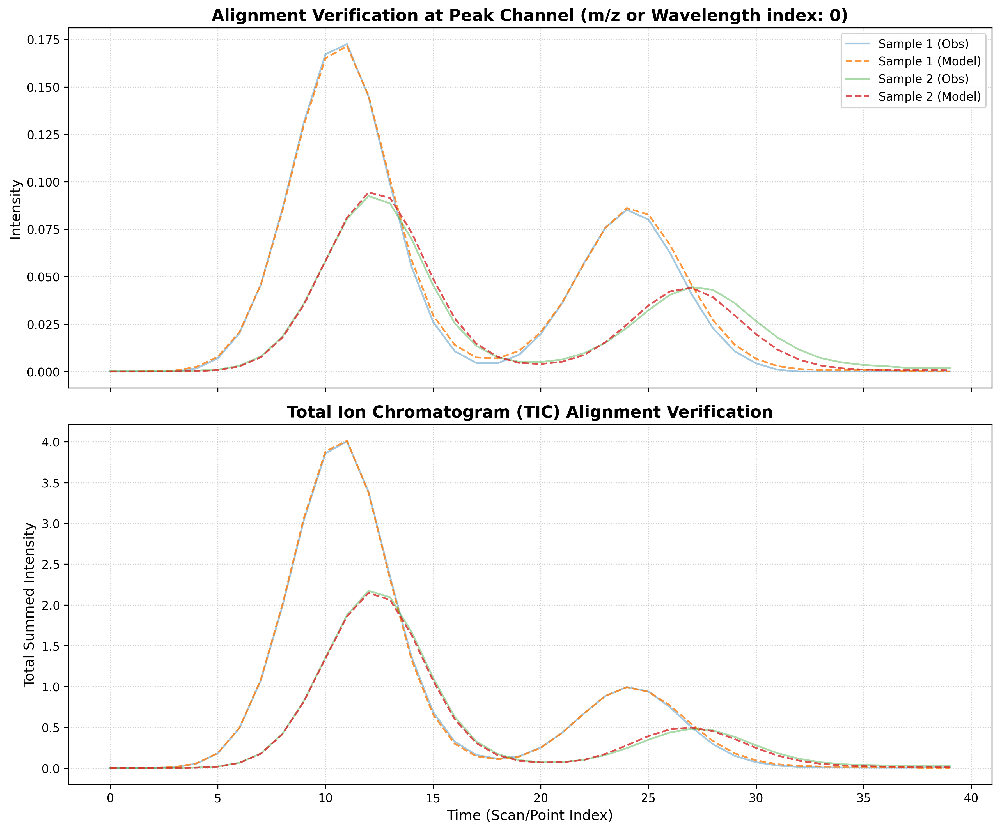

# Chroma-PETN Tauler Pesticides HPLC-DAD Dataset B Experiment Report

## 1. Executive Summary
This report summarizes the application of **Chroma-PETN** (Physics-Embedded Tensor Network) to **Real HPLC-DAD Dataset B** from Tauler et al. (1996). The system contains two target pesticides (Diazinon, Parathion-ethyl) and one unknown chemical interferent present in two mixture samples. The model successfully aligned the retention time profiles and resolved the scores, chromatograms, and spectra under target guidance constraints.

## 2. Model Performance Summary
| Metric | Value |
|---|---|
| **Model Type** | `HPLC_PETN` |
| **Components (R)** | 3 |
| **Final Loss (MSE)** | 7.14296e-07 |
| **Variance Explained (R² Fit %)** | **99.77%** |
| **Epochs Ran** | 906 |

## 3. Spectral Validation (Tucker Congruence Coefficient)
We validate the resolved spectra by calculating the **Tucker Congruence Coefficient (TCC)** against the pure reference standards included in the dataset:

| Resolved Component | Matched Pesticide | TCC Similarity | Status |
|---|---|---|---|
| **Component 1** | Diazinon (Analyte 1) | 1.0000 | **PASSED (High Similarity)** |
| **Component 2** | Parathion-ethyl (Analyte 2) | 1.0000 | **PASSED (High Similarity)** |
| **Component 3** | Unknown interferent | N/A | Resolved |

## 4. Resolved Sample Scores (A Loading)
The resolved score matrix illustrates the sample distribution of each component across the mixtures:

| index          | Component_1        | Component_2        | Component_3        |
| ---------------|--------------------|--------------------|------------------- |
| Mixture 1 (d1) | 0.6182894110679626 | 0.4282933473587036 | 0.5528771281242371 |
| Mixture 2 (d2) | 0.6442294716835022 | 0.2285124808549881 | 0.0                |

## 5. Learned Warping Parameters (Mean-Centered)
| sample         | alpha (stretch)       | beta (shift)          |
| ---------------|-----------------------|---------------------- |
| Mixture 1 (d1) | -0.015199130401015282 | -0.020986519753932953 |
| Mixture 2 (d2) | 0.015199130401015282  | 0.020986519753932953  |

## 6. Diagnostic Visualizations
### A. Resolved Loadings comparison against True Library Standards

### B. Component Scores distribution

### C. TIC Alignment Comparison

### D. Fitting Overlays

