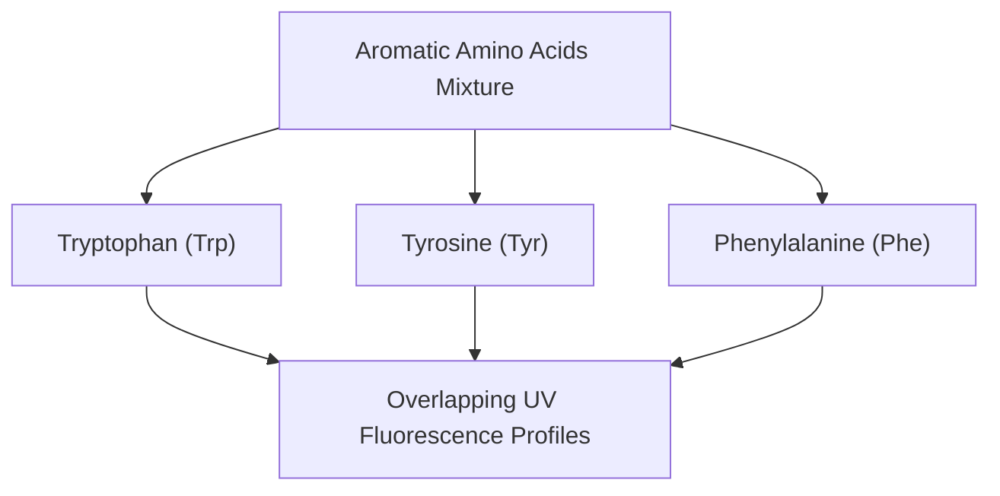

# Amino Acids EEM Spectroscopy Dataset Primer

This primer outlines the chemical context, data structures, and physical constraints of the experimental Amino Acids Excitation-Emission Matrix (EEM) spectroscopy dataset.

---

## 1. Chemical and Spectroscopic Context

### Fluorophores Profile
Aromatic amino acids are the primary naturally fluorescent chromophores (fluorophores) in proteins. This dataset contains mixtures of the three fluorescent amino acids:
1. **Tryptophan (Trp):** Strongest fluorophore, peaks around $\lambda_{ex} \approx 280\text{ nm}$ and $\lambda_{em} \approx 350\text{ nm}$.
2. **Tyrosine (Tyr):** Intermediate fluorescence, peaks around $\lambda_{ex} \approx 275\text{ nm}$ and $\lambda_{em} \approx 303\text{ nm}$.
3. **Phenylalanine (Phe):** Weakest fluorescence (quantum yield ~3%), peaks around $\lambda_{ex} \approx 260\text{ nm}$ and $\lambda_{em} \approx 282\text{ nm}$.

### Experimental Setup
* **Analytical Instrument:** Fluorescence Spectrometer recording multi-wavelength matrices.
* **Goal:** Decompose the overlapping emission/excitation bands and resolve individual concentration levels for each amino acid in the mixture.



---

## 2. Directory and File Structure

The dataset file is stored at:
`[data/eem/aminoacids/](file:///home/damianp/Proyectos/pinn_parafac/data/eem/aminoacids/)`

* **`[amino.mat](file:///home/damianp/Proyectos/pinn_parafac/data/eem/aminoacids/amino.mat)`**: The MATLAB workspace file containing the raw EEM coordinates and target concentrations.

---

## 3. Detailed Data Structures

The `.mat` workspace contains the following arrays:

| Variable | Dimension | Physical Representation | Description |
|---|---|---|---|
| **`X`** | `(5, 12261)` | Flattened observed EEM runs | 5 mixture runs. Each run is reshaped into a 2D matrix of shape `(61, 201)` (excitation x emission). |
| **`y`** | `(5, 3)` | Concentation scores | True concentration levels of Trp, Tyr, and Phe for each of the 5 samples. |
| **`ExAx`** | `(61, 1)` | Excitation wavelengths | 240 nm to 300 nm (step: 1 nm). |
| **`EmAx`** | `(201, 1)` | Emission wavelengths | 250 nm to 450 nm (step: 1 nm). |

> [!NOTE]
> The reshaped 3D EEM tensor has dimensions **`(5, 61, 201)`** representing `(Samples, Excitation Wavelengths, Emission Wavelengths)`.

---

## 4. Physical Scattering Constraints

EEM spectroscopy suffers from physical scattering bands that corrupt the chemical signal:
1. **1st-Order Rayleigh Scattering:** High-intensity diagonal band where emission wavelength equals excitation wavelength ($\lambda_{em} = \lambda_{ex}$). Width: $\pm 12\text{ nm}$.
2. **Solvent Raman Scattering:** Water molecules inelastic scattering that creates a shifted diagonal band:
   $$\lambda_{em,\text{Raman}} = \frac{\lambda_{ex}}{1.0 - 3.4 \times 10^{-4} \cdot \lambda_{ex}}$$
   Width: $\pm 10\text{ nm}$.

### EEM-PETN Custom Masked Loss
We construct a binary mask $W$ of shape `(61, 201)` where $W_{j,k} = 0$ inside the scattering diagonals, and $W_{j,k} = 1$ elsewhere. The model gradients are multiplied by $W$, blinding the trilinear core to scattering zones and forcing the neural network to interpolate the true chemical spectra underneath.

---

## 5. Python Integration: Loading Recipe

Below is the Python code to load the dataset and reshape it into a 3D tensor:

```python
import os
import scipy.io
import numpy as np

def load_aminoacids_dataset(data_dir):
    """
    Loads and reshapes the Amino Acids EEM dataset.
    
    Returns:
        X: 3D NumPy array of shape (Samples=5, Ex=61, Em=201)
        y_true: True concentration matrix of shape (5, 3)
        ex_wavelens: 1D array of excitation wavelengths (61,)
        em_wavelens: 1D array of emission wavelengths (201,)
    """
    mat_path = os.path.join(data_dir, "amino.mat")
    mat = scipy.io.loadmat(mat_path)
    
    ex_wavelens = mat['ExAx'].squeeze()
    em_wavelens = mat['EmAx'].squeeze()
    X_flat = mat['X']  # (5, 12261)
    y_true = mat['y']  # (5, 3)
    
    num_samples = X_flat.shape[0]
    num_ex = len(ex_wavelens)
    num_em = len(em_wavelens)
    
    # Reshape from Fortran column-major order to C-order
    X = X_flat.reshape(num_samples, num_ex, num_em)
    
    return X, y_true, ex_wavelens, em_wavelens
```
