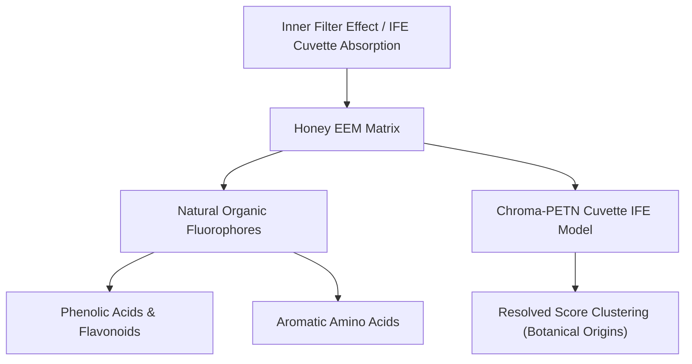

# Honey EEM Spectroscopy Dataset Primer

This primer outlines the ecological context, chemical significance, and data structures of the experimental Honey EEM spectroscopy dataset used for botanical origin classification.

---

## 1. Botanical and Spectroscopic Context

### Honey Classification
* **System Origin:** Natural honey samples collected from various regions, representing different botanical origins (e.g., Acacia, Chestnut, Linden, Clover, Sunflower, etc.).
* **Chemical Profile:** Honey is a complex matrix containing natural fluorophores such as phenolic compounds, flavonoids, proteins, and free amino acids. The concentrations and profiles of these fluorophores vary according to the flowers visited by the bees.
* **Goal:** Resolve the pure excitation and emission profiles of these natural fluorophores and use the resolved scores (concentrations) to classify the botanical origin of honey samples.



---

## 2. Directory and File Structure

The dataset file is stored at:
`[data/eem/honey/](file:///home/damianp/Proyectos/pinn_parafac/data/eem/honey/)`

* **`[HoneyEEM.mat](file:///home/damianp/Proyectos/pinn_parafac/data/eem/honey/HoneyEEM.mat)`**: The MATLAB workspace containing the honey EEM spectra and class labels.

---

## 3. Detailed Data Structures

The `.mat` file contains a nested structure under the `X` key. The main components are:

| Variable | Dimension | Description |
|---|---|---|
| **`dataset['data']`** | `(110, 741, 52)` | 110 honey samples, 741 emission wavelengths, and 52 excitation wavelengths. |
| **`dataset['axisscale'][1, 0]`** | `(741, 1)` | Emission axis wavelengths. |
| **`dataset['axisscale'][2, 0]`** | `(52, 1)` | Excitation axis wavelengths. |
| **`dataset['class']`** | `(110, 1)` | Class labels indicating the botanical origin of the honey samples. |

> [!TIP]
> The emission grid is typically downsampled by a factor of 4 (from 741 to 186 channels) to speed up training without losing critical shape information. Stacking these downsampled matrices yields a 3D tensor of shape **`(110, 186, 52)`**.

---

## 4. Inner Filter Effect (IFE) Cuvette Constraints

At high concentrations, honey samples absorb light significantly, suppressing the observed fluorescence intensity. This non-linear distortion is modeled using the cuvette Beer-Lambert equations:
* **Excitation Light Attenuation:**
  $$\text{Abs}_{\text{ex}, i}(j) = \sum_{r=1}^R a_{ir} \cdot (\alpha_r \cdot b_{jr}) + \text{Abs}_{\text{bg}, \text{ex}}(j)$$
* **Emission Light Attenuation:**
  $$\text{Abs}_{\text{em}, i}(k) = \text{Abs}_{\text{bg}, \text{em}}(k)$$
* **Combined Attenuation Factor ($\gamma$):**
  $$\gamma_i(j, k) = 10^{-(\text{Abs}_{\text{ex}, i}(j) + \text{Abs}_{\text{em}, i}(k))}$$
  Combination: $\hat{I}_{\text{obs}}(i, j, k) = I_{\text{true}}(i, j, k) \times \gamma_i(j, k)$.

---

## 5. Python Integration: Loading Recipe

Below is the Python code to load the dataset and downsample the grids:

```python
import os
import scipy.io
import numpy as np

def load_honey_dataset(data_dir):
    """
    Loads and downsamples the Honey EEM dataset.
    
    Returns:
        X: 3D NumPy array of shape (Samples=110, Em=186, Ex=52)
        ex_wavelens: 1D array of excitation wavelengths (52,)
        em_wavelens: 1D array of emission wavelengths (186,)
        class_ids: 1D array of botanical labels (110,)
    """
    mat_path = os.path.join(data_dir, "HoneyEEM.mat")
    mat = scipy.io.loadmat(mat_path)
    
    dataset = mat['X'][0, 0]
    X_raw = dataset['data']  # (110, 741, 52)
    em_wavelens = dataset['axisscale'][1, 0].squeeze()
    ex_wavelens = dataset['axisscale'][2, 0].squeeze()
    class_ids = dataset['class'].squeeze().astype(int)
    
    # Downsample emission grid by 4
    X = X_raw[:, ::4, :]
    em_wavelens = em_wavelens[::4]
    
    return X, ex_wavelens, em_wavelens, class_ids
```
