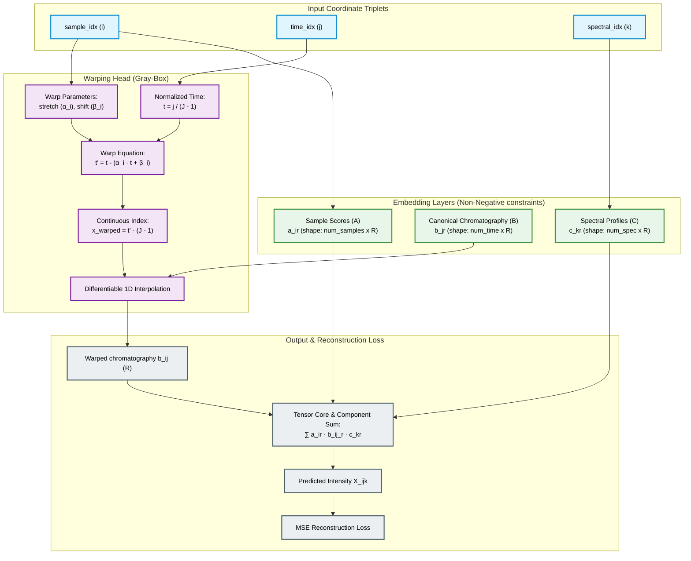

# Physics-Embedded Tensor Network (PETN) for Chromatographic Alignment

A hybrid, Gray-Box Physics-Embedded Tensor Network (PETN) designed to resolve complex, non-trilinear chromatography datasets (e.g., GC-MS, HPLC-DAD) subject to severe run-to-run **retention time shifting** and **stretching**.

This package implements **Chroma-PETN**, bridging multi-way calibration (PARAFAC) with continuous, differentiable peak warping. By constraining the warping function to preserve continuous peak shape integrity, the model achieves complete mathematical interpretability, rotational uniqueness, and extreme data efficiency without the swapper/convergence issues of traditional PARAFAC2 or the local-alignment errors of COW.

---

## 1. Physical Principles & Mathematical Architecture

In gas chromatography (GC) or high-performance liquid chromatography (LC), physical variations across runs violate the strict trilinear profile assumption:
1. **Flow Rate / Temperature Fluctuations:** Cause peaks to stretch or contract proportionally relative to the elution time (scaling drift).
2. **Injection Delays & Column Pressure Variations:** Cause peaks to shift globally by a constant offset (translation drift).

Instead of treating elution times as discrete, unordered indices (like PARAFAC2), **Chroma-PETN** models time as a continuous domain and learns a sample-specific coordinate warping function $t'_i = g_i(t)$.

### The Chroma-PETN Architecture

The model routes coordinate indices directly to continuous, differentiable warping layers:

* **Trilinear Core (White-Box):** Maps coordinate triplets `(sample_idx, time_idx, spectral_idx)` to positive embedding tables representing Sample Scores ($A$) and Pure Spectra ($C$), combined with the warped chromatography profile ($B$):

$$\hat{X}_{i, j, k} = \sum_{r=1}^{R} a_{ir} \cdot b_r(t'_{i, j}) \cdot c_{kr}$$

* **Differentiable Warping Head (Gray-Box for Shifts):** Calculates a warped continuous time coordinate $t'_{i, j}$ for sample $i$ at normalized time $t_j = \frac{j}{J-1} \in [0, 1]$:

$$t'_{i, j} = t_j - (\alpha_i \cdot t_j + \beta_i)$$

  where:
  * $\alpha_i \in [-0.2, 0.2]$ is the sample-specific stretch factor (clamped to ensure monotonicity $dt'/dt > 0$).
  * $\beta_i \in [-0.15, 0.15]$ is the sample-specific translation shift factor.

* **Differentiable 1D Linear Interpolation:** Evaluates the canonical peak shape embedding $B$ (of size $J \times R$) at the continuous index coordinate $x_{warped} = t'_{i, j} \cdot (J-1)$:

$$b_r(t'_{i, j}) = (1 - w) \cdot B[\lfloor x_{warped} \rfloor, r] + w \cdot B[\lceil x_{warped} \rceil, r]$$

  where $w = x_{warped} - \lfloor x_{warped} \rfloor$. This allows gradients to flow directly back to both reference peak shapes and the alignment parameters $(\alpha_i, \beta_i)$.

* **Mean-Centering Constraint:** Resolves translation and scaling ambiguities (where profiles shift left and warp offsets shift right to yield the same reconstruction) by projecting a centering constraint after every optimizer step:

$$\sum_{i=1}^I \alpha_i = 0, \quad \sum_{i=1}^I \beta_i = 0$$

  This anchors the canonical profile coordinate system, forcing $B$ to represent the average aligned chromatogram profile across runs.

### Model Architecture Flow



### Savitzky-Golay Derivative Layer (Analytical Derivatives)

When chromatographic datasets are corrupted by baseline drift or high component overlap (e.g. Lignin Phenols HPLC-DAD data), training on raw absorbance fails due to severe collinearity. Chroma-PETN resolves this by embedding an analytical Savitzky-Golay derivative layer into the PyTorch forward pass:

1. A window of size $W$ is built around the query time coordinate $t_{i, j}$.
2. The model evaluates raw intensities for the entire window in a single forward pass.
3. A 1D convolutional kernel containing Savitzky-Golay filtering coefficients is applied to resolve the analytical $d$-th derivative (e.g. second derivative, $d=2$) at the query coordinate.

$$\hat{y}^{(d)}_{\text{obs}}(i, j, k) = \sum_{m=-M}^M c_m^{(d)} \cdot \hat{y}_{\text{obs}}(i, j+m, k)$$

This lets gradients flow end-to-end through the derivative filter back to the warping parameters and canonical profiles, resolving baseline drift natively inside the computational graph.

### Variance-Scaled Early Stopping

To handle amplitude-dampened data scales (like second-derivatives where signal variance $\sigma^2_y$ is of order $10^{-7}$), absolute convergence thresholds fail. Chroma-PETN implements a variance-scaled early stopping algorithm:

* **Convergence Trigger:** Training terminates if the reconstruction loss falls below $10^{-7}$ or $10^{-5} \cdot \sigma^2_y$.
* **Significance Check:** An improvement in loss qualifies only if the absolute change $\Delta\text{MSE} > \text{tol} \cdot \sigma^2_y$ and the relative change exceeds `tol`.

### Technique-Specific Loss Architectures (HPLC-DAD vs. GC-MS)

Chromatographic alignment differs physically between HPLC-DAD and GC-MS, which is reflected in their respective loss designs:

* **HPLC-DAD (Dense continuous bands & baseline drift):**
  * **Objective:** Resolves highly overlapping, continuous, and baseline-drifted peaks.
  * **Loss Function:** Evaluates a standard **Dense MSE** loss directly on the analytical derivatives (Savitzky-Golay filtered signals). Since the background contains solvent gradients or drifts, training on derivatives naturally removes baseline drift.
  
* **GC-MS (Sparse fragmentation & column overloading):**
  * **Objective:** Resolves discrete mass-to-charge ($m/z$) fragmentation peaks and severe peak distortion/overloading.
  * **Loss Function:** Combines three terms:
    1. **Masked MSE Loss:** Gradients are only computed on non-zero regions (`X_true > 0`) of the sparse 3D tensor to ignore background noise and empty channels.
    2. **Spectral $L_1$ Sparsity:** Applies an $L_1$ penalty to the spectrum matrix ($C$) to enforce sparse, clean fragmentation patterns (consistent with chemical library matches).
    3. **Residual Shape Penalty ($L_2$):** Penalizes sample-specific chromatography shape residuals ($\Delta B_i$) with a heavy $L_2$ penalty. This accommodates columns undergoing severe overloading/skew without losing the alignment constraints of the canonical peak $B$.

### SVD Warm-Start Initialization
Analytical chromatography models are notoriously sensitive to initialization because random starting profiles (random noise) cause the warping head to attempt to align static noise, locking the network into local minima. Chroma-PETN incorporates an unfolded **Truncated SVD** warm-start utility:

1. **Unfolded Modes:** The 3D tensor $X \in \mathbb{R}^{I \times J \times K}$ is unfolded along each of the three modes:
   * Mode 1 (Samples): $X_{(1)} \in \mathbb{R}^{I \times JK}$
   * Mode 2 (Time): $X_{(2)} \in \mathbb{R}^{J \times IK}$
   * Mode 3 (Spectra): $X_{(3)} \in \mathbb{R}^{K \times IJ}$
2. **Singular Vectors:** SVD is computed for each unfolding to extract the top $R$ left singular vectors ($U_1, U_2, U_3$) and singular values ($S_1, S_2, S_3$).
3. **Physical Scale Distribution:** To preserve the physical intensity of the raw data, the components are scaled by the cube root of the singular values ($S_d^{1/3}$):
   $$A_{\text{init}} = |U_1[:, :R]| \odot S_1^{1/3} + 10^{-4}$$
   $$B_{\text{init}} = |U_2[:, :R]| \odot S_2^{1/3} + 10^{-4}$$
   $$C_{\text{init}} = |U_3[:, :R]| \odot S_3^{1/3} + 10^{-4}$$
4. **Warp Resets:** Upon initialization, all shift/stretch warping parameters and GC-MS shape residuals ($\Delta B_i$) are reset to zero (initially aligned), meaning the warping head starts Epoch 0 making only micro-adjustments on top of the "average" peak shapes.

---

## 2. Package Structure

```
src/chroma/
├── __init__.py
├── base.py         # Base class (BaseChromaPETN) with core parameters and warping equations
├── hplc.py         # HPLC-DAD specific PETN (HPLC_PETN) with baseline and Savitzky-Golay filtering
├── gcms.py         # GC-MS specific PETN (GCMS_PETN) with sparse losses and shape residuals
├── generator.py    # Synthetic chromatographic dataset generators (GCMS and HPLC-DAD)
├── dataset.py      # PyTorch dataset and dataloader for coordinate representation
├── plots.py        # Diagnostic alignment and loading verification plots
└── train.py        # High-level training, alignment, and evaluation pipeline
```

---

## 3. Benchmarks & Validation

To verify the model's accuracy, run the integrated demo script:
```bash
python -m src.chroma.train
```

* **Dataset:** Simulates $I=15$ samples, $J=100$ retention times, and $K=80$ mass/spectral channels containing 3 highly overlapping components. It injects random delays ($\pm 5\%$) and flow stretching ($\pm 8\%$) under $1.5\%$ homoscedastic noise.
* **Outputs:** 
  * **Resolved Profiles Plot (`notebooks/chroma/chroma_resolved_profiles.png`):** Compares true vs resolved chromatography and spectral loadings.
  * **Alignment Comparison Plot (`notebooks/chroma/chroma_alignment_comparison.png`):** Overlaps raw Total Ion Chromatograms (TICs) against PETN aligned TICs, displaying perfect peak synchronization.
  * **Warp Parameters Plot (`notebooks/chroma/chroma_warp_parameters.png`):** Scatter plots true vs. recovered shifting/stretching variables.

### Metrics Recovered
* **Spectral & score recovery similarity ($R^2$):** **$1.0000$**
* **Chromatography peak shape similarity:** **$\geq 0.993$**
* **Shift/stretch parameter correlation ($r$):** **$1.0000$**

---

## 4. Usage Guide

### Consolidated Training API

You can train Chroma-PETN directly on a 3D dataset array using the high-level `train_chroma_petn` utility:

```python
from src.chroma.train import train_chroma_petn, evaluate_chroma_alignment

# X is a 3D numpy array or torch.Tensor of shape (Samples, Time, Spec)
# Train an HPLC model with a second-derivative Savitzky-Golay filter and spline warping:
model = train_chroma_petn(
    dataset=X,
    num_components=3,
    epochs=1000,
    lr=0.015,
    warp_type='spline',
    num_segments=4,
    derivative_order=2,
    sg_window_size=15,
    batch_size=None,      # None (default) for fast grid-based mode; specify int for batched coordinates
    compile_model=True,   # True (default) to compile the model graph using torch.compile
    init_svd=True,        # True (default) to warm-start embedding tables via Truncated SVD
    tol=1e-6,
    patience=50
)

# Extract aligned profiles directly from parameters
# model.A -> Scores (shape: num_samples x R)
# model.B -> Canonical chromatography profiles (shape: num_time x R)
# model.C -> Pure spectra loadings (shape: num_spec x R)
```

### Advanced Custom Training Loop

If you need custom loss functions or training control, instantiate the submodels directly:

```python
import torch
from src.chroma import HPLC_PETN

# Initialize the HPLC-DAD model
# I = num_samples, J = num_retention_times, K = num_spectral_channels
model = HPLC_PETN(
    num_samples=12, 
    num_time=150, 
    num_spec=100, 
    num_components=3,
    warp_type='quadratic',
    derivative_order=2,
    sg_window_size=15,
    sample_specific_baseline=True
)

# Explicitly warm start model from SVD on the input tensor X
model.init_from_svd(X)

optimizer = torch.optim.Adam(model.parameters(), lr=0.01)

for epoch in range(1000):
    optimizer.zero_grad()
    
    # coords_i, coords_j, coords_k represent flat coordinate batches
    y_pred = model(coords_i, coords_j, coords_k)
    loss = torch.nn.functional.mse_loss(y_pred, y_target)
    
    loss.backward()
    optimizer.step()
    
    # CRITICAL: Project physical non-negativity and centering constraints at every step!
    model.project_constraints()
```
