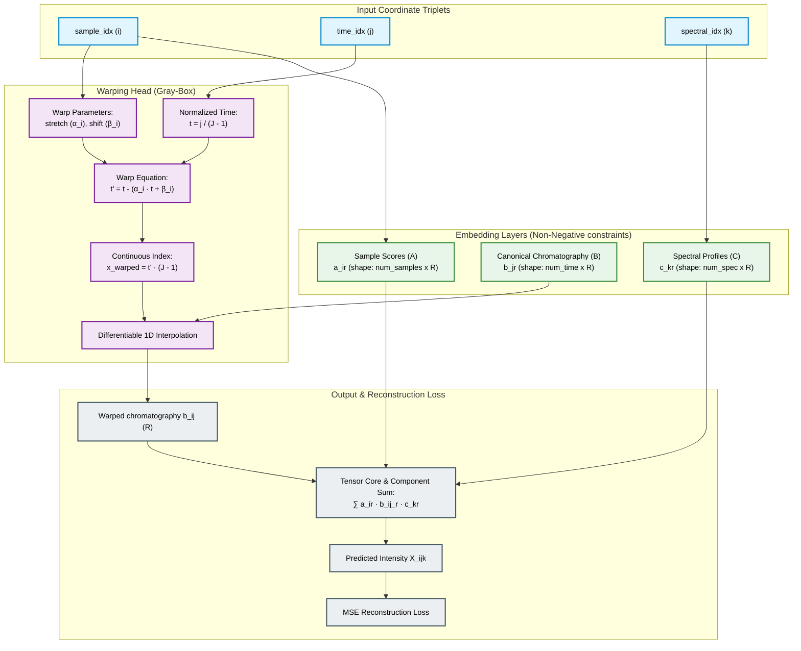

# Physics-Embedded Tensor Network (PETN) for Chromatographic Alignment

A hybrid, Gray-Box Physics-Embedded Tensor Network (PETN) designed to resolve complex, non-trilinear chromatography datasets (e.g., GC-MS, HPLC-DAD) subject to severe run-to-run **retention time shifting** and **stretching**.

This package implements **Chroma-PETN**, bridging multi-way calibration (PARAFAC) with continuous, differentiable peak warping. By constraining the warping function to preserve continuous peak shape integrity, the model achieves complete mathematical interpretability, rotational uniqueness, and extreme data efficiency without the swapper/convergence issues of traditional PARAFAC2 or the local-alignment errors of COW.

---

## 1. Physical Principles & Mathematical Architecture

In gas chromatography (GC) or high-performance liquid chromatography (LC), physical variations across runs violate the strict trilinear profile assumption:
1. **Flow Rate / Temperature Fluctuations:** Cause peaks to stretch or contract proportionally relative to the elution time (scaling drift).
2. **Injection Delays & Column Pressure Variations:** Cause peaks to shift globally by a constant offset (translation drift).

Instead of treating elution times as discrete, unordered indices (like PARAFAC2), **Chroma-PETN** models time as a continuous domain and learns a sample-specific coordinate warping function $t'_i = g_i(t)$.

### The Chroma-PETN Architecture

The model routes coordinate indices directly to continuous, differentiable warping layers:

* **Trilinear Core (White-Box):** Maps coordinate triplets `(sample_idx, time_idx, spectral_idx)` to positive embedding tables representing Sample Scores ($A$) and Pure Spectra ($C$), combined with the warped chromatography profile ($B$):

$$\hat{X}_{i, j, k} = \sum_{r=1}^{R} a_{ir} \cdot b_r(t'_{i, j}) \cdot c_{kr}$$

* **Differentiable Warping Head (Gray-Box for Shifts):** Calculates a warped continuous time coordinate $t'_{i, j}$ for sample $i$ at normalized time $t_j = \frac{j}{J-1} \in [0, 1]$:

$$t'_{i, j} = t_j - (\alpha_i \cdot t_j + \beta_i)$$

  where:
  * $\alpha_i \in [-0.2, 0.2]$ is the sample-specific stretch factor (clamped to ensure monotonicity $dt'/dt > 0$).
  * $\beta_i \in [-0.15, 0.15]$ is the sample-specific translation shift factor.

* **Differentiable 1D Linear Interpolation:** Evaluates the canonical peak shape embedding $B$ (of size $J \times R$) at the continuous index coordinate $x_{warped} = t'_{i, j} \cdot (J-1)$:

$$b_r(t'_{i, j}) = (1 - w) \cdot B[\lfloor x_{warped} \rfloor, r] + w \cdot B[\lceil x_{warped} \rceil, r]$$

  where $w = x_{warped} - \lfloor x_{warped} \rfloor$. This allows gradients to flow directly back to both reference peak shapes and the alignment parameters $(\alpha_i, \beta_i)$.

* **Mean-Centering Constraint:** Resolves translation and scaling ambiguities (where profiles shift left and warp offsets shift right to yield the same reconstruction) by projecting a centering constraint after every optimizer step:

$$\sum_{i=1}^I \alpha_i = 0, \quad \sum_{i=1}^I \beta_i = 0$$

  This anchors the canonical profile coordinate system, forcing $B$ to represent the average aligned chromatogram profile across runs.

### Model Architecture Flow



---

## 2. Package Structure

```
src/chroma/
├── __init__.py
├── model.py        # Chroma-PETN PyTorch model class
├── generator.py    # Synthetic chromatographic dataset simulator
└── train.py        # Training, alignment, and evaluation pipeline
```

---

## 3. Benchmarks & Validation

To verify the model's accuracy, run the integrated demo script:
```bash
python -m src.chroma.train
```

* **Dataset:** Simulates $I=15$ samples, $J=100$ retention times, and $K=80$ mass/spectral channels containing 3 highly overlapping components. It injects random delays ($\pm 5\%$) and flow stretching ($\pm 8\%$) under $1.5\%$ homoscedastic noise.
* **Outputs:** 
  * **Resolved Profiles Plot (`notebooks/chroma/chroma_resolved_profiles.png`):** Compares true vs resolved chromatography and spectral loadings.
  * **Alignment Comparison Plot (`notebooks/chroma/chroma_alignment_comparison.png`):** Overlaps raw Total Ion Chromatograms (TICs) against PETN aligned TICs, displaying perfect peak synchronization.
  * **Warp Parameters Plot (`notebooks/chroma/chroma_warp_parameters.png`):** Scatter plots true vs. recovered shifting/stretching variables.

### Metrics Recovered
* **Spectral & score recovery similarity ($R^2$):** **$1.0000$**
* **Chromatography peak shape similarity:** **$\geq 0.993$**
* **Shift/stretch parameter correlation ($r$):** **$1.0000$**

---

## 4. Usage Guide

### Importing the Model in Custom Workflows
You can import `ChromaPETN` directly to align your own experimental chromatograms:

```python
import torch
from src.chroma.model import ChromaPETN

# Initialize model
# I = num_samples, J = num_retention_times, K = num_spectral_channels
model = ChromaPETN(num_samples=12, num_time=150, num_spec=100, num_components=3)

# Train on coordinate batches
optimizer = torch.optim.Adam(model.parameters(), lr=0.01)

for epoch in range(1000):
    optimizer.zero_grad()
    
    # coords represent sample_idx, time_idx, spectral_idx batches
    y_pred = model(sample_idx, time_idx, spec_idx)
    loss = torch.nn.functional.mse_loss(y_pred, y_target)
    
    loss.backward()
    optimizer.step()
    
    # Enforce non-negativity and mean-centering at every step!
    model.project_constraints()
```
