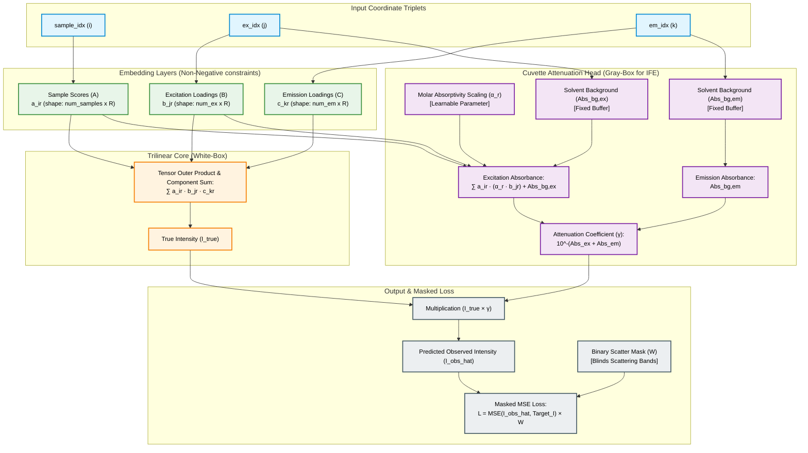

# Physics-Embedded Tensor Network (PETN) for EEM Spectroscopy

A hybrid, Gray-Box Physics-Embedded Tensor Network (PETN) designed to resolve Excitation-Emission Matrix (EEM) fluorescence spectroscopy data under severe optical scattering artifacts and non-linear Inner Filter Effects (IFE).

This project bridges classical multi-way chemometrics (such as PARAFAC) with modern deep learning. By restricting the neural network's hypothesis space using physical laws, the model achieves complete mathematical interpretability, rotational uniqueness, and extreme data efficiency—allowing robust calibration on standard small-scale laboratory datasets.

---

## 1. Physical Principles & Mathematical Architecture

Traditional multi-way calibration (e.g., linear PARAFAC) assumes a strict trilinear structure of clean chemical signals. However, real-world laboratory EEM data violates this assumption due to two major physical interferences:
1. **Optical Scattering:** 1st and 2nd order Rayleigh scattering ($\lambda_{\text{em}} = \lambda_{\text{ex}}$ and $\lambda_{\text{em}} = 2\lambda_{\text{ex}}$) and solvent Raman scattering create high-intensity diagonal bands that corrupt underlying chemical data.
2. **Inner Filter Effect (IFE):** Matrix absorption attenuates both excitation and emission light, causing a non-linear, concentration-dependent suppression and distortion of fluorescence intensity.

### The Physics-Embedded Cuvette Architecture

The model embeds physical laws directly into the PyTorch network graph, ensuring hard constraints rather than soft loss penalties:

* **Trilinear Core (White-Box):** Maps coordinate triplets `(sample_idx, ex_idx, em_idx)` to positive embedding tables representing Sample Scores ($A$), Excitation Loadings ($B$), and Emission Loadings ($C$), combined via a tensor outer product:

$$I_{\text{true}}(i,j,k) = \sum_{r=1}^{R} a_{ir} \cdot b_{jr} \cdot c_{kr}$$

* **Cuvette Attenuation Layer (Gray-Box for IFE):** Evaluates the Beer-Lambert and Lakowicz equations using a learnable component-specific molar absorptivity scale ($\alpha_r$) and registered solvent background absorbances ($\text{Abs}_{\text{bg}}$):

$$\text{Abs}_{\text{ex}, i}(j) = \sum_{r=1}^R a_{ir} \cdot (\alpha_r \cdot B_{jr}) + \text{Abs}_{\text{bg}, \text{ex}}(j)$$

$$\text{Abs}_{\text{em}, i}(k) = \text{Abs}_{\text{bg}, \text{em}}(k)$$

$$\gamma_i(j, k) = 10^{-(\text{Abs}_{\text{ex}, i}(j) + \text{Abs}_{\text{em}, i}(k))}$$

$$\hat{I}_{\text{obs}}(i, j, k) = I_{\text{true}}(i, j, k) \times \gamma_i(j, k)$$

* **Custom Masked Loss (Scattering Blinding):** Accepts a binary mask ($W$) where pixels on the Rayleigh/Raman scattering diagonals are `0` and valid data is `1`. Gradients are element-wise multiplied by this mask during backpropagation:

$$\mathcal{L} = \frac{1}{\sum W} \sum_{i,j,k} W_{i,j,k} \cdot \left( I_{\text{obs}}(i,j,k) - \hat{I}_{\text{obs}}(i,j,k) \right)^2$$

This blinds the model to scattering zones, forcing the rigid trilinear core to smoothly interpolate the true chemical signal directly underneath the artifacts.

### Model Architecture Flow



---

## 2. Repository Structure

```
petn_parafac/
├── data/
│   └── eem/
│       ├── aminoacids/
│       │   └── amino.mat              # Experimental Amino Acids benchmark dataset
│       └── honey/
│           └── HoneyEEM.mat           # Copenhagen Honey benchmark dataset
├── notebooks/
│   └── eem/
│       ├── datasets/
│       │   ├── aminoacids_dataset_context.md # Dataset context primer
│       │   └── honey_dataset_context.md      # Dataset context primer
│       └── experiments/
│           ├── aminoacids/
│           │   └── aminoacids_resolved_profiles.png
│           ├── honey/
│           │   ├── honey_resolved_profiles.png
│           │   └── honey_pca_separation.png
│           ├── simulated/
│           │   ├── mvp_resolved_profiles.png
│           │   ├── phase3_resolved_profiles.png
│           │   ├── phase3_resolved_absorptivities.png
│           │   ├── phase3_eem_heatmaps.png
│           │   ├── scores_comparison.png
│           │   └── simulated_experiment_report.md
│           └── benchmark/
│               ├── parafac_vs_petn_benchmark.csv
│               └── parafac_vs_petn_benchmark_report.md
src/
├── common/
│   ├── __init__.py
│   └── utils.py                       # Visualizations, early stopping, and plotting helpers
└── eem/
    ├── __init__.py
    ├── benchmark.py                   # EEM training benchmark script
    ├── download_aminoacids.py         # Utility to download the Amino Acids dataset
    ├── download_honey.py              # Utility to download the Copenhagen Honey dataset
    ├── generator.py                   # EEM synthetic generator with scatter & Lakowicz IFE
    ├── loss.py                        # Custom masked MSE loss implementation
    ├── model.py                       # PETNParafac custom model class in PyTorch
    ├── run_simulated_experiment.py    # Synthetic pipeline training loop
    ├── run_aminoacids_experiment.py   # Experimental Amino Acids validation script
    └── run_honey_experiment.py        # Copenhagen Honey validation and classifier script
tests/
└── eem/
    ├── test_generator.py          # Unit tests for the synthetic data generator
    ├── test_loss.py               # Unit tests for masked loss
    └── test_model.py              # Unit tests for PETN custom model
requirements.txt                   # Project python package requirements
README.md                          # Project documentation
```

---

## 3. Installation & Setup

1. **Clone the repository:**
   ```bash
   git clone https://github.com/username/petn_parafac.git
   cd petn_parafac
   ```
2. **Install dependencies:**
   ```bash
   pip install -r requirements.txt
   ```
3. **Run Automated Unit Tests:**
   To verify all model properties, constraints, and generator shapes:
   ```bash
   pytest
   ```

---

## 4. Benchmarks & Validation

The library is validated on three calibration benchmarks of increasing complexity:

### 4.1 Synthetic EEM Calibration Benchmark
Generates artificial mixtures of 3 chemical fluorophores under severe simulated Rayleigh (1st and 2nd order) and Raman scattering, as well as non-linear IFE attenuation.
* **Run Script:**
  ```bash
  python -m src.eem.run_simulated_experiment
  ```
* **Performance:** Resolves original loading profiles with high fidelity ($R^2 > 0.99$).
* **Outputs:** Plots comparing true vs resolved loadings are saved to `notebooks/eem/experiments/simulated/phase3_resolved_profiles.png`, `notebooks/eem/experiments/simulated/phase3_resolved_absorptivities.png`, and EEM heatmaps to `notebooks/eem/experiments/simulated/phase3_eem_heatmaps.png`.

### 4.2 Amino Acids Mixture Benchmark (Experimental)
An experimental dataset consisting of 5 mixtures containing Tryptophan, Tyrosine, and Phenylalanine under varying concentrations.
* **Run Script:**
  ```bash
  # Download the raw benchmark mat file
  python -m src.eem.download_aminoacids
  # Run calibration training
  python -m src.eem.run_aminoacids_experiment
  ```
* **Performance:** Achieves an average score recovery of $R^2 \approx 0.973$ compared to true prepared concentrations, resolving highly overlapping components.
* **Outputs:** Resolved spectra plots saved to `notebooks/eem/experiments/aminoacids/aminoacids_resolved_profiles.png`.

### 4.3 Copenhagen Honey Benchmark (Experimental)
A complex real-world benchmark containing 110 honey samples (5 botanical origin classes, including authentic and adulterated samples) resolved using a 6-component PETN model.
* **Run Script:**
  ```bash
  # Download the raw benchmark mat file
  python -m src.eem.download_honey
  # Run calibration and classification evaluation
  python -m src.eem.run_honey_experiment
  ```
* **Performance:** Evaluated using Leave-One-Out (LOO) cross-validation on the resolved sample scores:
  * **Binary Adulteration Accuracy (Authentic vs. Fake):** **100.00%** using SVM / Logistic Regression.
  * **Multiclass Botanical Origin Classification:** **74.55%** accuracy across 5 classes (representing state-of-the-art resolution on raw un-curated datasets without outlier filtration).
* **Outputs:**
  * Resolved spectral excitation/emission loadings and molar absorptivities saved to `notebooks/eem/experiments/honey/honey_resolved_profiles.png`.
  * PCA score cluster separation visualization saved to `notebooks/eem/experiments/honey/honey_pca_separation.png`.

---

## 5. Usage

To apply `PETNParafac` to your custom dataset:

```python
import torch
import torch.optim as optim
from src.eem.model import PETNParafac
from src.eem.loss import masked_mse_loss


# 1. Define dimensions and spectral grids
num_samples = 20
num_ex = 40
num_em = 150
ex_wavelens = [250.0 + i*5 for i in range(num_ex)]
em_wavelens = [300.0 + i*2 for i in range(num_em)]

# Coordinate triplets matching flat intensity indices
sample_idx = torch.randint(0, num_samples, (1000,))
ex_idx = torch.randint(0, num_ex, (1000,))
em_idx = torch.randint(0, num_em, (1000,))
target_intensity = torch.rand(1000,)
mask_values = torch.ones(1000,)  # 0 on scattering bands, 1 elsewhere

# 2. Instantiate the Physics-Embedded model
model = PETNParafac(
    num_samples=num_samples,
    num_ex=num_ex,
    num_em=num_em,
    ex_wavelens=ex_wavelens,
    em_wavelens=em_wavelens,
    num_components=3
)

# 3. Setup optimizer
optimizer = optim.Adam(model.parameters(), lr=0.01)

# 4. Training loop
for epoch in range(100):
    model.train()
    optimizer.zero_grad()
    
    # Predict and compute masked loss
    predictions = model(sample_idx, ex_idx, em_idx)
    loss = masked_mse_loss(predictions, target_intensity, mask=mask_values)
    
    loss.backward()
    optimizer.step()
    
    # Enforce physical non-negativity constraints via projection
    model.project_constraints()

# 5. Extract resolved, interpretable factors
with torch.no_grad():
    scores = model.sample_embeddings.weight.numpy()
    ex_loadings = model.ex_embeddings.weight.numpy()
    em_loadings = model.em_embeddings.weight.numpy()
    molar_abs, _ = model.get_learned_absorptivities()
```

---

## 6. Interactive Cuvette Simulator & Dashboard

An interactive Streamlit-based dashboard is provided to visualize the model training process in real time on synthetic datasets. The dashboard simulates Rayleigh/Raman scattering, Inner Filter Effects (IFE), and homoscedastic noise, allowing you to directly compare `PETN-PARAFAC` against `Classical PARAFAC`.

### Features
* **Live Solver Animation**: Watch the model weights align with the ground truth excitation and emission loadings epoch-by-epoch.
* **Corrupted vs. Recovered Heatmaps**: Select any sample and visually compare the True Clean EEM, the Corrupted EEM, the Model Reconstructed observed EEM, and the Recovered Clean EEM.
* **Physical Parameter Verification**: Compare true molar absorptivities ($E = \alpha \cdot B$) and registered solvent background profiles against the model's learned weights.

### How to Run
Run the following command in your terminal from the project root:
```bash
streamlit run app.py
```

